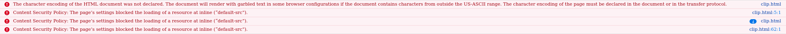
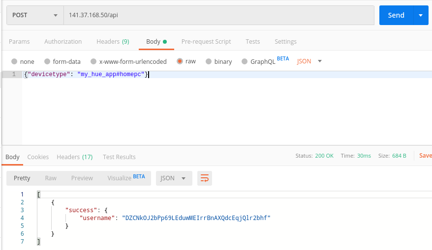
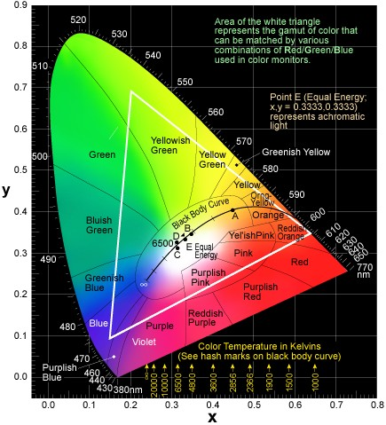
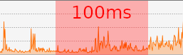

# Laboratory 3: Smart Home Light Bulb
#### by Tom Georgi & Joshua Rutschmann

## Table of Contents

  - [0. Main Exercise](#0-main-exercise)
  - [1. Web App](#1-using-web-app-to-connect)
  - [2. Executing simple commands](#2-executing-simple-commands)
  - [3. Colors](#3-colors-and-the-cie)
  - [4. Design Concept](#4-design-concept)
  - [5. Program Design](#5-program-design)


## 0. Main Exercise

    Develop an application and implement a (approved) functionality. The application must have an interactive user interface for launching the mentioned function and (optionally) other functionality.

## 1. Using web app to connect

The web app didn't work so we used postman to send our commands because the web app does the same thing. The web app simply runs on the bridge and inside a webpage but nothing more.



This seems to be a too strict setting of the nginx webserver not allowing the page to load its sources.

## 2. Executing simple commands

    Register with the Hue Bridge and control the state of the Philips Hue Bulb.
    Pick a unique color and set color(value), saturation and brightness.
    Change them.


1. **Authentication / Registration: Retrieving the username.**

    We tested the communication with the lamp and bridge using postman, which is running locally.
    
    Therefore we needed to **POST** the address `http://<huebridge-ip>/api` and also specify the device type using JSON in the message body. The key inside the JSON object must be `"devicetype"` and the value `"my_hue_app#<devicename>"`.
    
    **POST** <u>141.37.168.50/api</u>

    
    
    The we took note of the received username. Given that we want to get the username programatically we could use following pseudo code: `result[0]["success"]["username"]`.

    The username in this example is **DZCNkOJ2bPp69LEduwMEIrrBnAXQdcEqjQlr2bhf**.

1. **Fetching present light bulbs**

    To control our lamp we first need to know whether it is already registered and which identifier it has.
    The previously retrieved username is needed to call any api function. So we pass it as a part of the route in every further call:

    **GET** <u>141.37.168.50/api/**DZCNkOJ2bPp69LEduwMEIrrBnAXQdcEqjQlr2bhf**/lights/</u>

1. **Switching light bulb on and off**

    Before you can set the color of the lamp you have to switch it on.
    This is how we do it:

    **PUT** <u>141.37.168.50/api/**DZCNkOJ2bPp69LEduwMEIrrBnAXQdcEqjQlr2bhf**/lights/1/state</u>

    - To switch on the lamp we need to send this as the requests body: `{"on" : true}`
    - To switch it off we need to send: `{"on" : false}`


1. **Picking a color**


    We chose the color orange and we set it like this:

    **PUT** <u>141.37.168.50/api/**DZCNkOJ2bPp69LEduwMEIrrBnAXQdcEqjQlr2bhf**/lights/1/state</u>

    - For orange`{"on":true, "sat":255, "bri":255, "hue":10000}`
    - For a brighter orange `{"on":true, "sat":255, "bri":255, "hue":10000}`

    Because we also force its state to be on, we do not need to make sure that it is switched on beforehand.


## 3. Colors and the C.I.E.

Here we can see the XYZ color space defined by the International Commission on Illumination. (C.I.E. is the acronym for the french name of the commision "Commission internationale de l'éclairage"). 

Every color inside the white triangle can be emitted by our philips hue light bulb. The black line inside the trinagle shows the different color temperatures of the white color. 


    

## 4. Design Concept

-
    Our Lightbulb should monitor one of these conditions:
    - CPU Load
    - RAM Usage

    
    This is extremly useful if you have a server which you want to monitor. Instead of looking at the servers load via remote access (manual polling) your room light changes its color according to the systems load. A green color represents 0% load or 0% memory usage and red represents 100% load / memory usage.
    
    Another mode is the threshold mode. Given that you do not want the lightbulb to be on all the time and want to guarantee that your machine is not in an overloaded sitution the lamp only gets activated if you 

    If you start the program for the first time you are prompted to press the button on the Philips Hue Bridge. The username, generated by the hue bridge, is persistently stored for later program launches.


## 5. Program Design

- 
    We chose the language Rust as our language because it is fast and stable.
    A big advantage is that we can easily include "libraries". In Rust they are called crates and hese are the crates that we used:

    - [philipshue](https://crates.io/crates/philipshue)
        - For controlling the hue bridge and lamp
    - [cpu-monitor](https://crates.io/crates/cpu-monitor)
        - To monitor CPU
    - [ctrlc](https://crates.io/crates/ctrlc)
        - For canceling the program with Ctrl + C 
    - [text-io](https://crates.io/crates/text-io)
        - For reading input from stdin
    - [sys-info](https://crates.io/crates/sys-info)
        - For retrieving memory usage


    We take a time slice of 100 ms and measure the non idle time of the machines processor. This makes the measurement more precise than only using one point in time. Also a period of 100ms still makes this application almost "realtime" capable. Before the CPU fans spin up the light bulb already indicates a rising CPU load.

    

    One thread handles the users input and the other measures CPU/RAM and controls the light accordingly. If you start the program you will get a shell like prompt.

    ```
    Measuring Systems CPU...
    syshue>_
    ```
    
    
    You can specify the threshold level by sending `Threshold: 20%` to the program. It accepts integer percentages from 0% to 100%.

    Furthermore one can define the brightness of the lamp by executing `Brightness: 20` to the program. The valid range is between 0 and 255.

    Here is a demo use of *syshue*:

    ```
    Measuring Systems CPU...
    syshue> Brightness: 125
    [OK] Setting brightness to 125
    syshue> Threshold: 45%
    [OK] Setting threshold to 45%
    syshue> Mode: MEM
    [OK] Tracking Memory now.
    syshue> Mode: CPU
    [OK] Tracking CPU usage now.
    syshue> ^C                        
    Successfully switched light off
    ```