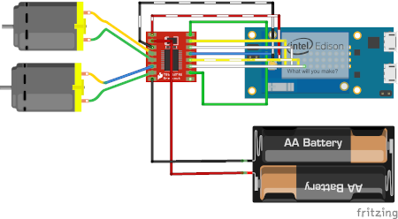

# Laboratory 2: Edison autonomous car
#### by Tom Georgi & Joshua Rutschmann

## 0. Exercise

    Design a remote controlled system that drives the car. The main functionality is driving back and forwards, left and right. As remote operator you can use a PS4 Controller, a Web Interface or an App on a smartphone.

## 1. The Hardware

The following schematic shows how the motors are connected to the Indel Edison Board. The H-Bridge is left out to simply the schematic.
    

## 2. Design Concept

-
    The construction of our remote-controlled car consists of three connected components: Car hardware, control software and remote control. Using the control software written by us, the commands sent by the remote controller are captured and processed in form of events.
    After the events have been processed by the control software, the results should be sent to the hardware installed in the car.
    This makes it possible to control the car remotely.

## 3. Conntect to a PS4 Remote Controller

-
    The task was to select a remote control with which it should be possible to control the car remotely. The following were available:
    - PS4-Controller
    - WebInterface
    - Keyboard
    - Smartphone App
  
- 
    We chose the PS4 controller because:
    - it reminds more of a remote controlled car than a keyboard or a web interface.
    - it would also be so easy to use for e.g. children
    - the connection between car and PS4 controller is very simple and fast to make.

## 3.1. Advantages / Disadvantages

-
    The advantage of the PS4 controller is its ease of use. 
    If you compare this e.g. with a keyboard, a PS4 controller has a manageable number of possibilities to control the car, while a keyboard has much more control possibilities. This can be an advantage if you have a lot of control commands, but in our case it is a disadvantage because it makes our program much more complex for the end user. 
    
    As an example: If the user wants to drive forward, he simply presses the stick forward on the controller, while he could also enter the speed value via a number on the keyboard. This would give the user much more control options, but it would also make the program more error-prone. This is normally not the case with the PS4 controller. Here it is calculated depending on the position of the stick and the car is passed on. 
    
    Another advantage is the connection of controller and car. Once the devices are paired with each other, a Bluetooth connection is automatically established the next time both devices are started.

    In addition, there is the type of connection. While e.g. a keyboard or a web interface requires an intact network connection on the control device (host computer) as well as on the car (target computer) itself, the PS4 controller only requires an activated Bluetooth connection. The advantage is that the Bluetooth connection is less prone to errors and you can use the car regardless of the location.

## 4. Program Design

We have a main loop in which we first check for controller events, control the motors accordingly and then save the speed commands in memory (if the record mode is enabled).

## 5. Autonomous car features

- The Recording Mode
- Park sideways
