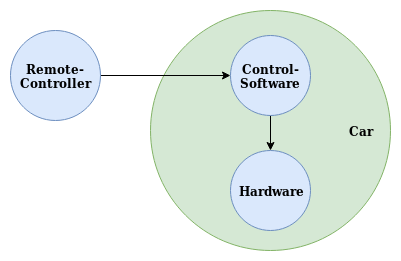
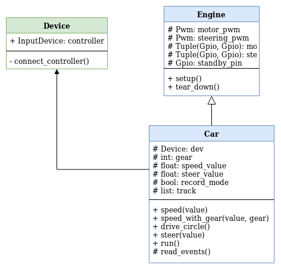

# Laboratory 2: Edison autonomous car
#### by Tom Georgi & Joshua Rutschmann

## Table of Contents

  - [0. Exercise](#0-exercise)
  - [1. The Hardware](#1-the-hardware)
  - [2. Design Concept](#2-design-concept)
  - [3. Conntect to a PS4 Remote Controller](#3-conntect-to-a-ps4-remote-controller)
  - [3.1. Advantages](#31-advantages)
  - [3.2 Disadvantages](#32-disadvantages)
  - [4. How does the Communication work](#4-how-does-the-communication-work)
  - [5. Program Design](#5-program-design)
  - [6. Autonomous car features](#6-autonomous-car-features)

## 0. Exercise

    Design a remote controlled system that drives the car. 
    The main functionality is driving back and forwards, left and right.
    As remote operator you can use a PS4 Controller, a Web Interface or 
    an App on a smartphone.

## 1. The Hardware

-
    The following schematic shows how the motors are connected to the Indel Edison Board. The H bridge is left out to simplify the schematic. The red breakout board is the motor driver (TB6612FNG). It can power up to two DC motors with a constant current of 1,2 A (3,2 A peak). The two pins (IN1 and IN2) can be used to set the mode in which the motors will be driven: CW (clockwise), CCW (counterclockwise), Short-Brake and Stop. The two motor outputs (A and B) can be driven seperately and the speed of each motor is controlled by the PWM input signal with a maximum frequency of 100 kHz. The motor outputs (A and B) are connected to our H bridge. We pull up the STBY pin of the *TB6612FNG* to activate the motor driver.
    
    

## 2. Design Concept

-
    The construction of our remote-controlled car consists of three connected components:
    - Car hardware
    - Control software
    - Remote control
    
    The construction can also be seen in picture below. Using the control software written by us, the commands sent by the remote controller are captured and processed in form of events. The movement of the sticks should be mapped to 0 - 100 % PWM 
    After the events have been processed by the control software, the results should be sent to the hardware installed in the car.
    This makes it possible to control the car remotely.

    

## 3. Conntect to a PS4 Remote Controller

-
    The task was to select a remote control with which it should be possible to control the car remotely. The following were available:
    - PS4-Controller
    - WebInterface
    - Keyboard
    - Smartphone App
  
- 
    We chose the PS4 controller because:
    - it reminds more of a remote controlled car than a keyboard or a web interface.
    - it would also be so easy to use for e.g. children
    - the connection between car and PS4 controller is very simple and fast to make.

## 3.1. Advantages

-
    The advantage of the PS4 controller is its ease of use and the existence of analog sticks (potentiometers).
    If you compare this e.g. with a keyboard, a PS4 controller has a manageable number of possibilities to control the car, while a keyboard has much more control possibilities. This can be an advantage if you have a lot of control commands, but in our case it is a disadvantage because it makes our program much more complex for the end user. 
    The two sticks and the two triggers are not binary that means we can get analog values (0 - 256) for the movement between not pressed and fully pressed. This makes it way easier to control the speed or steering comparing to the keyboard.
    
    As an example: If the user wants to drive forward he simply presses the stick forward on the controller while he could also enter the speed value as a number on the keyboard. This would give the user much more control options, but it would also make the program more error-prone. This is normally not the case with the PS4 controller. With the controller the speed of the car is calculated depending on the position of the stick. 
    
    Another advantage is the connection of controller and car. Once the devices are paired with each other, a Bluetooth connection is automatically established the next time both devices are started.

    In addition, there is the type of connection. While e.g. a keyboard or a web interface requires an intact network connection on the control device (host computer) as well as on the car (target computer) itself, the PS4 controller only requires an activated Bluetooth connection. The advantage is that the Bluetooth connection is less prone to errors and you can use the car regardless of the location.

## 3.2 Disadvantages

-
    A disadvantage of the PS4 controller is the feedback/output. While you can transmit information to the user through the graphical interface of a web interface, a keyboard program or a smartphone app, this is completely omitted with the PS4 controller. For example, you don't notice if the car or the code has an error that could lead to an abort. With the other control methods errors are faster and easier to recognize, because you can log them and then output them to a graphical interface. 

    Another disadvantage is the termination condition. While with the other remote controllers the catching of exceptions is mostly supported by the programming language and can be handled much easier. This is also possible with the PS4 controller, but much more difficult to realize.

    As an example: If 'Ctrl-C' is pressed on the keyboard, an error called 'KeyboardInterrupt' is thrown in the programming language Python. This error can be caught and treated as a program abort. If you press a defined key on the PS4 controller, which should lead to the termination of the program, all previously received events are processed first. This can lead to accidents during long running tasks, which could damage the car. You could run the long-running tasks in a thread, but it would increase the complexity of the program. That's why we see this as a disadvantage.

## 4. How does the Communication work

-
    To communicate with the PS4 controller in our program we use the Python package `evdev`. It contains a class `InputDevice` which is used by us to create an interface between our program and the PS4 controller. The class also contains a method `read()`. The method reads all incoming signals from the PS4 controller and converts them into events. These events can then be further processed in our program. If now an event comes from the controller like e.g. "right stick moved", then our car should drive forward or backward. For this we have to write a value to the corresponding pin. In order to be allowed to write values to a pin, we have to be able to access the hardware somehow. We do this by using the library `mraa`. This allows us to create and describe the pins contained on our board in form of variables in Python. Through these two libraries / packages we are able to create a connection between PS4 controller and auto hardware and let both communicate with each other.

## 5. Program Design

- 
    The picture below shows the Program Design.

    

    Our program is divided into three classes.
    The class `Device` should provide the PS4 controller within the program. Furthermore, when starting the program, it should check whether the device can be connected to the car. 

    The class `Engine` shall simulate the engine control of a real car. It contains the necessary pins to control the car. It also contains methods that can be used to start and stop the car.

    The class `Car` should be the heart of the program. It contains information about the current speed, the angle of the steering axle and also information about the current gear. In addition, there is also information about our autonomous feature, which will be described in more detail in the next chapter. To process incoming events of our 'Device' object (PS4 controller) the class `Car` contains a method `run()`. This method takes care of reading and processing events as well as error handling in case of an abort.

## 6. Autonomous car features

-
    The developed autonomous feature is called `tracking`.
    In the so-called `record-mode` it records all values which are passed on to the motors (steering motor, speed motor). The `record-mode` can be switched on and off at will. After the `record-mode` has been terminated, the recording can be played forward or backward using the following keys:
    
    - The ⬛-Key replays the recording
    - The ◯-Key replays the recorded track in reverse
    
    If the `record-mode` is activated, a new recording is started. Only the last recording will be stored. 
